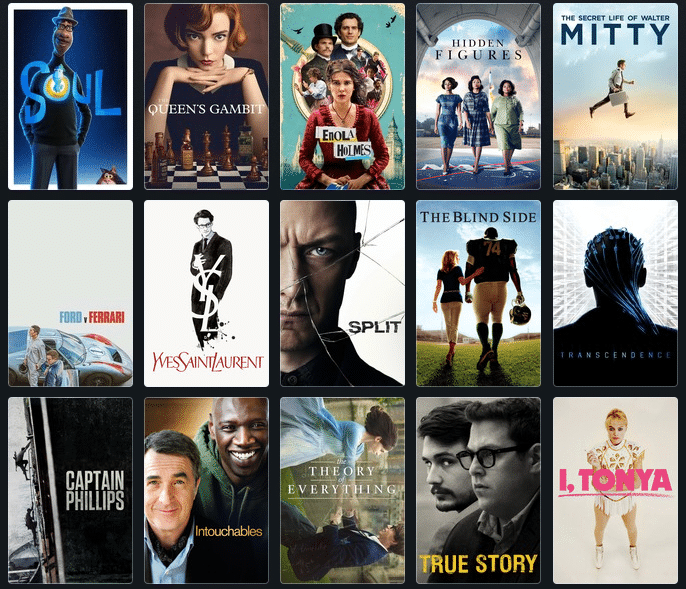

# INGENIAS-Pre-entrega3

<h1 align="center" style = "margin: 0 auto;  height: 200px; overflow: hidden;" >
  <p align="center">PELICULAS</p>
  <a href="" ></a>
</h1>

## Tabla de contenidos
- [INGENIAS-Pre-entrega3](#ingenias-pre-entrega3)
  - [Tabla de contenidos](#tabla-de-contenidos)
    - [Información General](#información-general)
    - [Importar BD](#importar-bd)
    - [Tablas SQL](#tablas-sql)
    - [Colaboradores](#colaboradores)

### Información General
***
<div class="warning" style='padding:0.1em; background-color:#E9D8FD; color:#69337A'>
<span>
<p style='margin-left:1em;'>
Se generó una Base de datos Trailerflix con sus tablas y datos del json enviado para este TP.
</p>
</p></span>
</div>
 


### Importar BD
***
<ul>
<li>
  <p >Abrir MYSQL y crear un Schema haciendo click con botón derecho de mouse. Seleccionar Create Schema:</p>
  <a href="" ></a>
</li>
<li>
  <p >En name escribir trailerflix y Charset/Collation utf8. Finalmente presionar Apply:</p>
  <a href="" ></a>
</li>
<li>
  <p>Una vez creada la BD trailerflix hacer click sobre ella y seleccionar en el menú de arriba, Server, Data Import:</p>
  <a href="" ></a>
    <p>Si no aparece se puede hacer desde acá:</p>
    <a href="" ></a>
</li>
<li>
  <p>Hacer click en Import from Self-Contained Field y seleccionar la carpeta y el archivo, donde guardaron el archivo trailerflix.sql.</p>
</li>
<li>
    <p>En Default Target Schema seleccionar trailerflix y presionar botón Start Import (abajo a la derecha):</p>
    <a href="" ></a>
</li>
</ul>


### Tablas SQL
***
```javascript
// Abrir MYSQL y crear un Schema haciendo click con botón derecho de mouse. Seleccionar Create Schema:

  actores
  categorias
  generos
  peliculas
  peliculas_tags
  rankings
  repartos
  tags
  
```


<!-- ### Graficos 
```mermaid

``` -->
### Colaboradores 
***
<!-- <a href="https://github.com/antonellamino/INGENIAS-Pre-entrega2/graphs/contributors" target="_blank">
</a>
  <a href="https://github.com/antonellamino/INGENIAS-Pre-entrega2/graphs/contributors" target="_blank">
</a> -->
<!--  -->